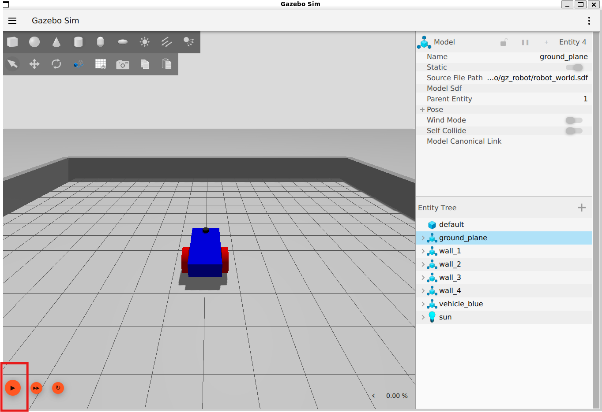

# Building simple robot world in Gazebo

## Credits
- [Gazebo Tutorial](https://gazebosim.org/docs/harmonic/tutorials/)

## Dependencies
- ROS2 Jazzy & Gazebo
- Ubuntu 24.04 LTS
- install gazebo launch vendor package

```
sudo apt install ros-jazzy-gz-launch-vendor* -y
```
Update ROS path
```
source ~/opt/ros/jazzy/setup.bash
```

## Avoid obstacle
```
gz launch avoid_obstacle.gzlaunch
```

Now click on the play button (on bottom left of gazebo screen) to see the robot moving as shown in the image below



## Separate world and robot files
It is also possible to have two different sdf files - one for the robot (`./description/robot.sdf`) and another for the world (`./worlds/custom_world.sdf`).  The corresponding launch command is as follows:
```
gz launch robot_world.gzlaunch
```

## Launch Gazebo using ROS2 and use `ros_gz_bridge` to access gazebo topics
```
ros2 launch gz_robot.launch.py
```
Open a terminal and list the topics as:
```
ros2 topic list
```
Open another terminal and provide command to the robot:
```
ros2 topic pub /cmd_vel geometry_msgs/msg/Twist "{linear: {x: 2.0, y: 0.0, z: 0.0}, angular: {x: 0.0, y: 0.0, z: 1.8}}"

```
You can see that the robot is moving in a circle.  Also you can check the sensor output by using the
following command:

```
ros2 topic echo /lidar
```

