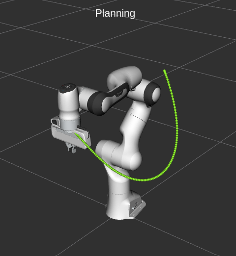
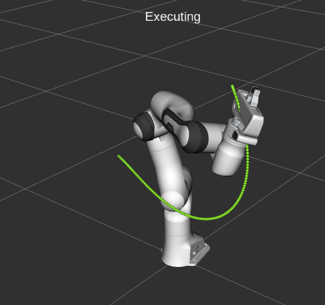
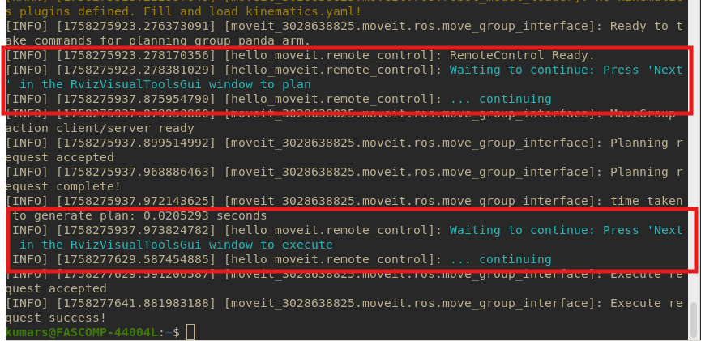

# Motion Planning with MoveIt2


## Credits/Source
- [Moveit Tutorial Documentation](https://moveit.picknik.ai/main/doc/tutorials/tutorials.html)

## Dependencies
- Ubuntu 24.04 LTS
- ROS2 Jazzy

## Installation
Install Moveit2 binary for ROS2 Jazzy
```
sudo apt install ros-jazzy-moveit
sudo apt install ros-jazzy-resources-panda-moveit-config
```

Update ros dependency tree
```
sudo apt install python3-rosdep
sudo rosdep init
sudo rosdep update:
```

Install colcon related packages
```
sudo apt install python3-colcon-common-extensions 
sudo apt install python3-colcon-mixin 
colcon mixin add default https://raw.githubusercontent.com/colcon/colcon-mixin-repository/master/index.yaml 
colcon mixin update default
```

## Moveit QuickStart RVIZ Demo

Launch the Panda-Arm demo
```
source /opt/ros/jazzy/setup.bash
ros2 launch moveit_resources_panda_moveit_config demo.launch.py
```
Make sure that you are able to interact with the panda robot arm as described on the [MoveIt Quickstart tutorial](https://moveit.picknik.ai/main/doc/tutorials/quickstart_in_rviz/quickstart_in_rviz_tutorial.html). 

## Controlling the robot using C++ Node

Detailed instructions for this part is available [here](https://moveit.picknik.ai/main/doc/tutorials/your_first_project/your_first_project.html) and [here](https://moveit.picknik.ai/main/doc/tutorials/visualizing_in_rviz/visualizing_in_rviz.html). You will have to do some minor changes to the `hello_moveit.cpp` file. Change `manipulator` to `panda_arm` and `base_link` to `panda_link0`. 

Download the repository in your home directory

```
git clone https://github.com/swagatk/ros2_gazebo.git
```

Create a moveit workspace
```
mkdir -p ~/moveit_ws/src
cd ~/moveit_ws/src
```
Move the required folder inside `~/moveit_ws/src` as shown below

```
cp -r ~/ros2_gazebo/moveit_demo ./
```
Build the package

```
cd ~/moveit_ws
colcon build --mixin debug
source ~/moveit_ws/install/setup.bash
```

On one terminal, launch the rviz demo for panda robot arm
```
ros2 launch moveit_resources_panda_moveit_config demo.launch.py
```
Now make following changes to the RVIZ window: 
* Uncheck `Rviz2-->Displays-->MotionPlanning`
* Ensure `Displays-->MarkerArray-->Topic-->/rviz_visual_tools`
* Add Panel: `Rviz2-->Panels-->RvizVisualToolsGui`

If `MarkerArray` is not available on the `Displays` pane, you can click on the `Add` button at the bottom to add.


Run the following command in another window to see the robot move to the goal state. Please read the messages on the console to see the stages of operation. Click on `Next` `button RvizVisualToolGui` to move from planning to execution. 

```
ros2 run hello_moveit hello_moveit
```
## Images

| Planning | Execution |
|------ | ---- |
| ||




 

