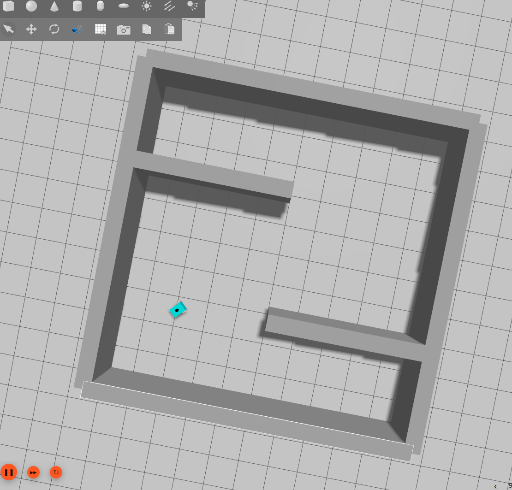
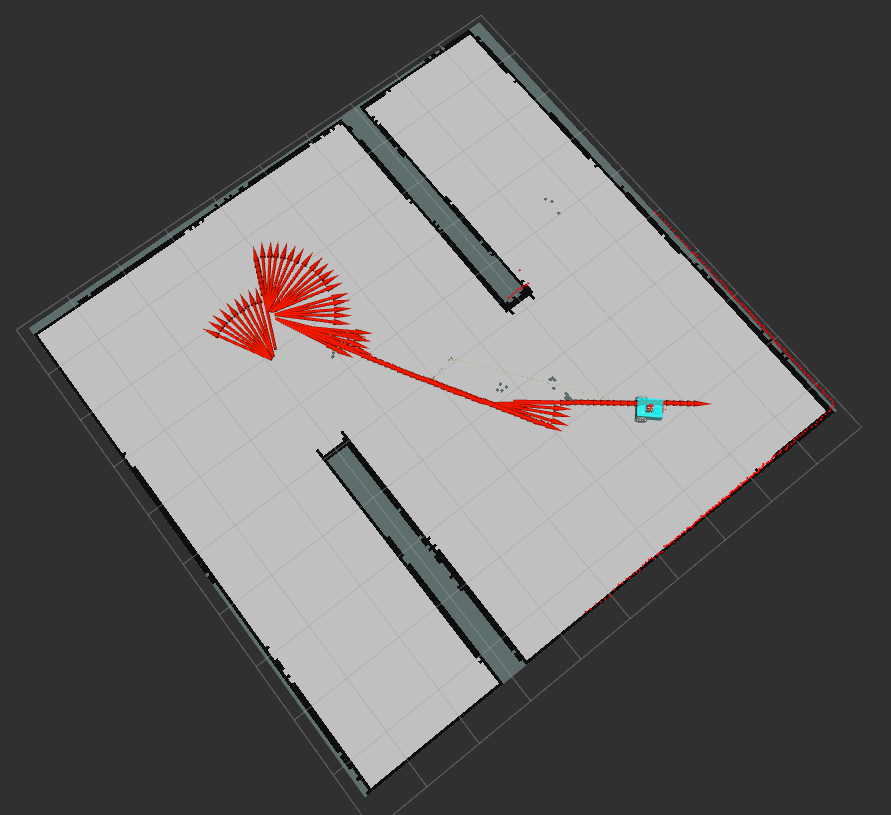

# Building Map using Nav2 and SLAM toolbox

## Dependencies
- Ubuntu 24.04 LTS
- [ROS2 Jazzy](https://docs.ros.org/en/jazzy/Installation/Ubuntu-Install-Debs.html)
- [Gazebo Harmonic](https://gazebosim.org/docs/harmonic/ros_installation/)
```
sudo apt-get install ros-${ROS_DISTRO}-ros-gz
```

## Resources/Credits
- [Nav2 Documentation](https://docs.nav2.org/setup_guides/index.html)
- [ROS2 Jazzy Documenation](https://docs.ros.org/en/jazzy/Tutorials.html)

## Download & Install
Download the package into your home directory `~/`:
```
git clone https://github.com/swagatk/ros2_gazebo.git
```

copy the folder `~/ros2_gazebo/my_robot_sim/` to the `src` folder of your local ros2 workspace.
```
cp -r ~/ros2_gazebo/my_robot_sim ~/ros2_ws/src/
cd ~/ros2_ws
```
Install required dependencies for the ros package
```
sudo apt install python3-rosdep
sudo rosdep init
rosdep update
rosdep install --from-paths src --ignore-src -r -y
```
Build the package:
```
colcon build --packages-select my_robot_sim
source install/setup.bash
```
Now launch the application
```
ros2 launch my_robot_sim display.launch.py
```

## Install dependencies
Install the following packages if `rosdep install` does not resolve the dependencies:
```
sudo apt install ros-jazzy-xacro
sudo apt install ros-jazzy-sdformat-urdf
sudo apt install ros-jazzy-ros-gz
sudo apt install ros-jazzy-gazebo-ros-pkgs
sudo apt install ros-jazzy-robot-localization

```
## Launch SLAM toolbox
Install `slam_toolbox` package
```
sudo apt install ros-jazzy-slam-toolbox
```

Now execute the following command in a separate terminal:
```
ros2 launch slam_toolbox online_async_launch.py use_sim_time:=true
```
## Launch Nav2

Install `nav2` packages:
```
sudo apt install ros-jazzy-navigation2
sudo apt install ros-jazzy-nav2-bringup
```
Now execute the following command in a separate terminal: 
```
ros2 launch nav2_bringup navigation_launch.py use_sim_time:=true param_files:=/home/swagat/ros2_ws/my_robot_sim/config/nav2_params.yaml
```

## Move the robot 
Run the following node in a separate terminal to allow moving the robot using keyboard:
```
ros2 run teleop_twist_keyboard teleop_twist_keyboard cmd_vel:=/demo/cmd_vel
```

## RVIZ visualization
Add the following `display type` items to Rviz to visualize the map etc. 
* Add --> Map --> /global_costmap/costmap
* Add --> LaserScan --> /scan
* Add --> Odometry --> /demo/odom

Also change `Fixed Frame` item in `Global Options` to `map` to visualize the formation of map as the robot moves. 

## Images
Gazebo environment and the map generated is as shown below

Gazebo Environment with Robot
 

Map Generated using `slam_toolbox`
|

## Obstacle avoidance
Run the following node on a separate terminal to make the robot move autonomously avoiding obstacles.

```
ros2 run my_robot_sim avoid_obstacle
```

## Wall following 

```
ros2 run my_robot_sim follow_wall
```
